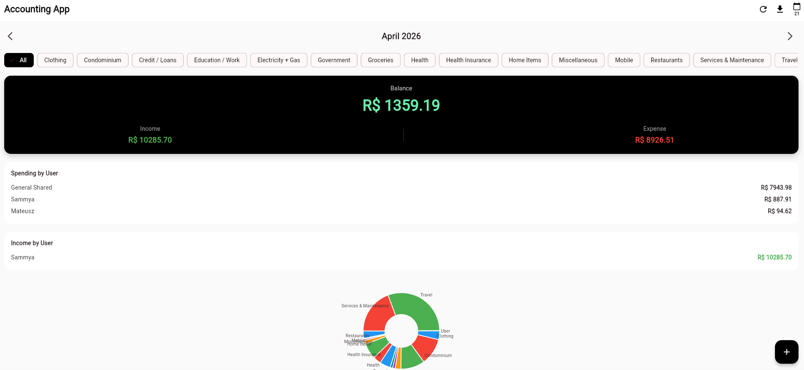

# Family Accounting App 🏦

## Overview

Welcome to the **Family Accounting App** repository! This is a modern, full-stack application designed to provide families and individuals with precise control over their finances. Unlike simple expense trackers, this application handles complex real-world financial scenarios such as credit card billing cycles, dynamic monthly closing days, recurring expense materialization, and multi-user tracking. 

It is built with scalability in mind, currently transitioning to a robust multi-tenant SaaS architecture.

## 🚀 Key Features

*   **📊 Comprehensive Dashboard & Analytics:** Understand financial health at a glance. Visualizes total earnings, spending, and available balance with breakdown charts by category and user (powered by `fl_chart`).
*   **💳 Smart Credit Card Billing Cycles:** Accurately tracks expenses against credit card closing days (e.g., expenses made after the 23rd automatically roll over to the next billing period). Supports manual month-to-month closing day overrides for total accuracy.
*   **📈 Investment & Portfolio Management:** Track diverse investment types (Stocks, Crypto, Real Estate, etc.). Provides a real-time view of portfolio composition, cost basis, and distributions.
*   **🔁 Automated Recurring Payments:** Define recurring bills (e.g., Netflix, Rent, Internet), and the backend automatically materializes these expenses exactly on the scheduled day of each month. Includes sophisticated duplication-detection.
*   **📑 Professional Excel Reporting:** One-click generation of comprehensive monthly Excel reports. Built with Python `pandas` and `xlsxwriter`, the reports categorize spending, earnings, and user breakdowns into formatted analytical sheets.
*   **👨‍👩‍👧‍👦 Multi-User Ready:** Built from the ground up to support multiple profiles (family members) contributing to a unified budget. Currently evolving into a fully isolated multi-tenant SaaS.

## 💻 Tech Stack

### Frontend (Mobile App)
*   **Framework:** Flutter (Dart)
*   **UI/UX:** Material Design, `fl_chart` for data visualization.
*   **State Management & Backend Integration:** Future-proofed architecture utilizing Services/Repositories interacting with REST APIs and Supabase.

### Backend (REST API)
*   **Framework:** Python & Flask
*   **Data Processing:** `pandas` and `xlsxwriter` for complex data aggregation and Excel report generation.
*   **API Capabilities:** Cross-Origin Resource Sharing (CORS) enabled, structured REST endpoints handling complex business logic (e.g., Date math for recurring expenses, closing window calculations).

### Database && Infrastructure
*   **Database:** Supabase (PostgreSQL)
*   **Schema Features:** Complex relational ties between `expenses`, `earnings`, `investments`, `recurring_expenses`, `payment_methods`, and `closing_day_overrides`.

## 🧠 Technical Highlights for Recruiters

*   **Complex Date & Time Handling:** The backend demonstrates advanced date math to handle dynamic credit card closing dates. This includes properly scoping PostgreSQL queries to fetch expenses that belong to a specific billing cycle rather than just a calendar month.
*   **Automated Data Materialization:** The `materialize_recurring_expenses` logic in the Flask API evaluates active recurring subscriptions, checks target execution dates, handles edge-case short months (e.g., Feb 28th vs 31st), and securely inserts generated expenses directly into the SQL layer.
*   **Clean Architecture Patterns:** The REST API strictly delegates data access and business logic into structured Python services (e.g., `investment_service.py`, `closing_day_service.py`), keeping the main Flask endpoints focused purely on HTTP lifecycle routing.

## 🗺️ Roadmap & Next Steps

Currently executing **SaaS Multi-tenant Architecture Conversion**:
1.  **Strict Data Isolation:** Implementing Row Level Security (RLS) in PostgreSQL.
2.  **Authentication Engine:** Complete Supabase Auth integration (JWT verification to secure all Flask API endpoints).
3.  **Monetization / Stripe Integration:** Future inclusion of subscription plans with Stripe for SaaS billing.

---
*Built with ❤️ focusing on clean code, practical financial management, and real-world utility.*
